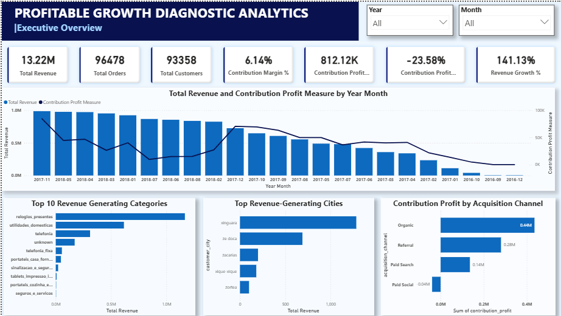

# 📈 Profitable Growth Diagnostic Analytics


> An end-to-end Business Intelligence project that investigates why **revenue increased by 141% while contribution profit declined by 23.58%**.

## 📊 Executive Summary

| KPI | Value |
|------|------:|
| Revenue Growth | **141.13%** |
| Contribution Profit Growth | **-23.58%** |
| Total Revenue | **R$ 13.22M** |
| Total Orders | **96,478** |
| Total Customers | **93,358** |
| Contribution Margin | **6.14%** |



---

## 🚀 Project Highlights

- Built an end-to-end analytics pipeline using **SQL, Python, and Power BI**
- Analyzed **110K+ order items** and **96K+ orders**
- Designed an executive dashboard with **8+ business KPIs**
- Identified why **141% revenue growth resulted in a 23.58% decline in contribution profit**
- Generated actionable recommendations for improving profitability

---

# Business Problem

Growing revenue does not always mean a business is becoming more profitable.

This project analyzes an e-commerce business to answer an important executive question:

> **Why did revenue grow significantly while profitability declined?**

The objective was to identify operational and commercial factors responsible for declining contribution profit and recommend actions that improve sustainable business growth.

---

# Project Objectives

- Analyze revenue growth trends
- Measure contribution profit performance
- Identify top-performing product categories
- Identify highest revenue-generating cities
- Evaluate acquisition channel profitability
- Build an executive Power BI dashboard
- Deliver actionable business recommendations

---

# Tech Stack

- SQL (PostgreSQL)
- Python
- Pandas
- NumPy
- Matplotlib
- Jupyter Notebook
- Power BI
- Git & GitHub

---

# Project Workflow

Raw Dataset

↓

SQL Data Validation

↓

Python Data Cleaning

↓

Exploratory Data Analysis

↓

Business Insights

↓

Profitability Modeling

↓

Power BI Dashboard

↓

Executive Recommendations

---

# Key Business Insights

### Revenue Growth

- Revenue increased by **141.13%** (Jan–Aug YoY)

### Contribution Profit

- Contribution Profit declined by **23.58%**

### Customer Growth

- Customers increased by over **114%**

### Product Categories

- A small number of categories generated the majority of revenue.

### Geography

- Revenue is concentrated within a few major cities.

### Acquisition Channels

- Organic and Referral channels generated the highest contribution profit.
- Paid acquisition channels produced significantly lower profitability.

---

# Business Recommendations

- Prioritize profitable acquisition channels.
- Reduce spending on low-return marketing campaigns.
- Improve profitability within low-margin product categories.
- Focus on sustainable profit growth instead of revenue growth alone.

---

# Repository Structure

```text
dashboard/
notebooks/
sql/
data/
images/
README.md
requirements.txt
```

---

# Skills Demonstrated

- SQL
- Data Cleaning
- Exploratory Data Analysis
- Business Analytics
- KPI Development
- Profitability Analysis
- Power BI
- Data Visualization
- Executive Reporting
- Business Storytelling

---

# Author

**Vineet Chaudhari**

Computer Engineering Student

Aspiring Data Analyst